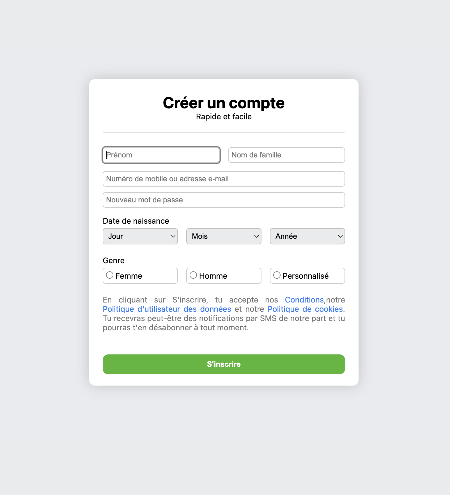
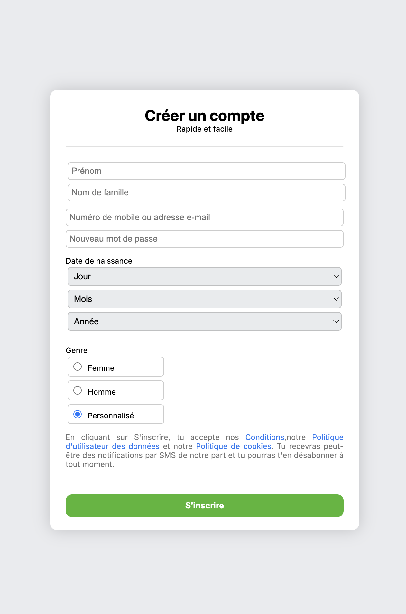

## Google page sign up page
### Les différentes balise utiliser : 
- form: pour un formulaire, c'est à dire une section d'un document qui contient des contrôles interactifs permettant à un utilisateur de fournir des information
- hr: est qui balise qui permet partagé notre page par un tiret
- input: champs de saisie qui permet à l'utilisateur de saisir les informations necéssaire
- - placeholder: attribut de input qui permet de mettre une phrase par defaut dans le champs 
- label: pour afficher du text, qui explique ou indique les informations attendu dans le champ
- select: c'est un selecteur peut contenir plusieurs valeur
- - option: est un sous élément du secteur qui permet de stocker les differentes valeur possible

### L'expérience :
* Ce projet m'a poussé à fournir davantages d'efforts pour approfondir les petits details qui passe souvent inaperçus.
## Laptop 

## Tablet et mobile
